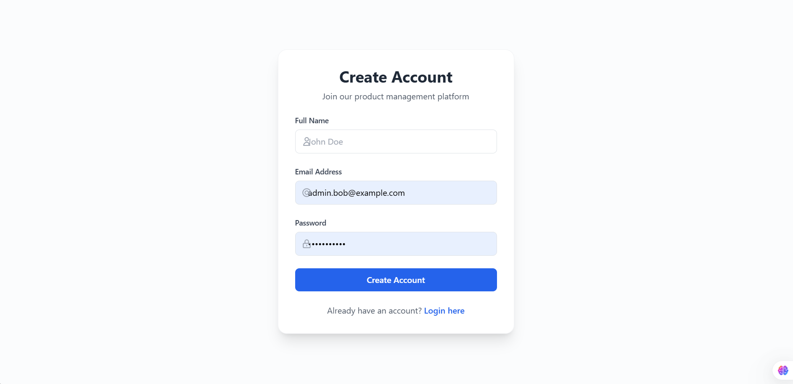

# Product Management System

## Overview

A comprehensive product management system built with the MERN stack (MongoDB, Express.js, React.js, Node.js). This application allows users to manage products efficiently with features like product creation, listing, updating, and deletion.

## Features

- User Authentication (Login/Register)
- Product Management
  - Add new products
  - View product listings
  - Update product details
  - Delete products
- Responsive Design

## Technologies Used

- **Frontend:**
  - React.js
  - React Router DOM
  - Bootstrap for styling
  - Axios for API calls

- **Backend:**
  - Node.js
  - Express.js
  - MongoDB with Mongoose
 

## Screeshots

.png>)
## Getting Started

### Prerequisites

- Node.js (v14 or higher)
- MongoDB installed locally or MongoDB Atlas account
- Git

### Installation

1. Clone the repository:
   ```bash
   git clone https://github.com/kyubi321/Product-Managment.git
   cd Product-Managment
   ```

2. Frontend Setup:
   ```bash
   cd frontend
   npm install
   npm run dev
   ```
   Access the frontend at: `http://localhost:5173`

3. Backend Setup:
   ```bash
   cd backend
   npm install
   npm start
   ```
   The server will run on: `http://localhost:3000`


## Contributing

1. Fork the repository
2. Create your feature branch (`git checkout -b feature/AmazingFeature`)
3. Commit your changes (`git commit -m 'Add some AmazingFeature'`)
4. Push to the branch (`git push origin feature/AmazingFeature`)
5. Open a Pull Request

## License

This project is licensed under the MIT License.

## Authors

- [Amar](https://github.com/kyubi321)

## Show your support

Give a ⭐️ if this project helped you!